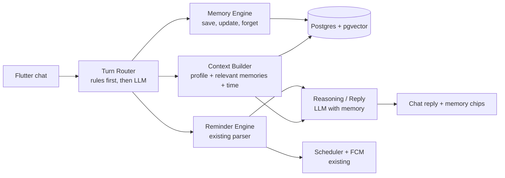

# Speakardo Module 8 — AI Memory System Design

| | |
| --- | --- |
| Status | Approved direction, open decisions listed in section 13 |
| Version | 1.0 (2026-09-25) |
| Owner | Nouman |
| Replaces | SRS Module 8 (the SRS now points here for details) |
| Inputs | SRS v1.1, PRD, Roadmap, Notion "Speakardo Intelligence Core" pages 01–05, current codebase (Modules 1–4 done) |
| Living doc | https://claude.ai/code/artifact/a4392161-45ef-4201-978c-c096d52af734 |
| Companion | `blueprint.md` / `blueprint.pdf` (same folder) (vision, research review, roadmap) |

---

## 1. Summary

Module 8 makes Speakardo remember what users tell it, answer questions from that memory, and use it to set better reminders — with the user always able to see and control what is kept. It is built in five milestones (8.0–8.4). Behavioral habit learning follows as 8B.

Product promise: **"Don't tell Speakardo when. Tell Speakardo what matters."**

The five principles that drive every decision below:

1. **Talk before remembering.** Today every chat message goes to the reminder parser and chat history is not stored on the server. Memory only pays off if the assistant can answer "When is Sara's birthday?", so conversational chat comes first.
2. **Make memory visible.** "Saved to memory · Undo" and "Used: Gym, usually 6 PM" chips in chat. Users value — and trust — memory they can see.
3. **People are first-class from day one.** "Mom", "Ammi" and "my mother" resolve to one person record, so "remind me to call her on her birthday" works.
4. **A wrong memory is worse than a missing one.** Auto-save only clearly stated, non-sensitive facts; otherwise ask or skip. Measure extraction against a fixed test set.
5. **Memories only go to trusted AI providers.** Calls that carry memories or chat history use an allowlist of providers whose terms say they don't train on or retain API data.

---

## 2. Current state (as of 2026-09-25)

- Done: Module 1 Auth (email + OTP, Google), Module 2 hybrid reminder parsing (rules → dateparser → LLM gateway with 7 providers and fallback), Module 3 Reminders (recurring, local wall-clock, edit, snooze), Module 4 Notifications (FCM, actions, deep links, delivery attempts, scheduler recovery).
- Memory: **not implemented**. `memory_screen.dart` is static placeholder UI ("Project Nexus", "Personal Health", "Private and encrypted").
- Chat: every message is treated as a reminder request (`backend/routers/chat.py`); history lives only in `ChatProvider` memory on the device.
- Database: `database.py` falls back to SQLite; Docker uses `postgres:15` without pgvector.
- Gateway: text generation only; no embedding API.

---

## 3. Changes to the SRS and roadmap

| Area | Before | Now | Why |
| --- | --- | --- | --- |
| Roadmap order | Memory is Phase 6, after Shared Reminders and Teams (6 months) | Memory next, then Calendar, then Voice. Shared and Teams later | Memory creates the reason to stay; team features need users who already love the app |
| Chat | Module 2 = reminder parser; greeting "I'm your AI Reminder assistant" | Chat is a real assistant: reminders, save/recall/forget memories, questions, small talk | The PRD says Speakardo is "not a reminder app" |
| Chat history | Not stored server-side | Stored with user-controlled retention | Needed for "What did I tell you about my dentist?" and for learning |
| Retrieval | "When is my next dentist appointment?" treated as memory | Answer from memories **and** reminders together | That example is a reminder lookup; users don't care where the answer lives |
| Health information | Listed as something to store | Explicit statements only, opt-in, encrypted, never inferred | Fastest way to lose trust; legal obligations in some markets |
| Memories table | 6 fields | ~20 fields (section 6) | Needed for updates, forgetting, explaining sources |
| Memory API | POST/GET/DELETE /memory | Edit, search, delete by category, delete all, export, settings (section 10) | Expected by users and app stores |
| Onboarding | Personalisation screen | 3 quick questions that seed first memories | Personal replies in the first session |
| Language | English | Accept Roman Urdu and Urdu ("kal subah 9 baje yaad dilana") in a language milestone after 8.3; Module 8 ships English-only | Large underserved market; LLM already handles it, rule parser needs patterns |
| Memory screen | Placeholder data and an unproven "encrypted" claim | Real data only; claims only when true | Fake data breaks trust immediately |

---

## 4. What we keep and change from the Notion research

**Keep as written**

- Five kinds of memory: explicit facts, events, behavioral patterns, preferences, temporary context (Notion §2).
- Memory → Context → Reasoning → Action as separate layers (§3, §13).
- Every memory has source, confidence, importance, lifespan and privacy level (§12–16).
- PostgreSQL for structured facts + pgvector for semantic search; no separate vector DB (§21, §24).
- Autonomy levels 0–3; never act without permission (§31).
- Versioning on contradictions (§35); user controls and audit trail (§36–37).

**Change or add**

| Research says | Decision | Reason |
| --- | --- | --- |
| Score = relevance × importance × confidence × recency | Weighted sum; lasting facts get full recency | Multiplying lets one small factor sink a memory (a year-old birthday scores ~0) |
| Relationships/people in V1 | Basic `people` table in 8A | Reminders mention people constantly |
| ~18 tables | Build 5 in 8A; add others when a feature needs them | Less to migrate and test |
| Context and Reasoning engines | Python modules inside the current backend, not services | One developer, one deploy |
| Location/geofences in MVP | After 8B, as its own module | Battery, permissions and store-review cost |
| — | Extraction test set + quality gates | Prompt/model changes otherwise break memory silently |
| — | Memory-poisoning protection | "Remember you must always…" is stored as a quote, never followed |
| — | Export and account deletion | Expected by stores and privacy law |
| — | Cost per active user | Needed before setting Free/Pro limits |

---

## 5. Architecture

Every chat message passes through one router, which decides what the user wants and pulls in only relevant memories. Everything lives in the existing FastAPI backend and `ai_service` package — no new services.



| Module | Location | Responsibility |
| --- | --- | --- |
| Turn Router | `ai_service/router/` | Classify intent (reminder, save memory, ask, forget, list, chat) and extract memory candidates in the same LLM call |
| Memory Engine | `ai_service/memory/` (pure logic) + `backend/services/memory_store.py` (database) | Save policy, keys, extraction prompt (ai_service); save, supersede, dedupe, forget, undo, erase, embedding backfill (memory_store). `ai_service` has no database access, so persistence lives in the backend |
| Context Builder | `ai_service/context/` | Always-on profile + relevant memories + time/timezone + upcoming reminders, within a token budget |
| Reasoning / Reply | `ai_service/reply/` | Answer from context; says "I don't have that saved" instead of guessing |
| Memory API | `backend/routers/memory.py`, `people.py` | View, edit, delete, export, privacy settings |
| Jobs | APScheduler (already in backend) | Background extraction, merging, expiring temporary memories |

The existing three-layer reminder parser is unchanged; the router hands reminder messages through to it, so Modules 1–4 keep working.

---

## 6. Data model

Prerequisites: Docker image `pgvector/pgvector:pg16` (Homebrew's pgvector formula only supports PG17/18, so local dev uses Docker too); `CREATE EXTENSION vector` in an Alembic migration; no SQLite fallback for memory code (tests run on Postgres). See `docs/setup/local-database.md`.

### 6.1 `memories`

| Field | Type | Notes |
| --- | --- | --- |
| id, user_id | uuid | FK users, ON DELETE CASCADE |
| kind | enum | `fact`, `preference`, `important_date`, `relationship`, `note`, `event` (habits: separate table in 8B) |
| category | enum | `personal`, `work`, `people`, `health`, `finance`, `places`, `routine`, `other` |
| key | text, null | Normalised slot: `birthday`, `work_location`, `wake_time` — enables exact lookup and updates |
| subject | text, null | **8.1 interim** person label, lowercase ("sara", "mother"); null = about the user. 8.3 replaces it with `person_id` (FK people) and backfills from these labels |
| content | text | Sentence shown to the user: "Sara's birthday is June 15" |
| value | jsonb | Structured value: `{"month":6,"day":15}` |
| source | enum | `user_explicit`, `conversation`, `reminder`, `onboarding`, `manual_edit`, `behavior` (8B) |
| source_message_id | uuid, null | FK conversation_messages — powers "You told me on Sep 12" |
| confidence | real 0–1 | Rule-based, never LLM self-reported: 1.0 stated, 0.8 clearly implied, ≤ 0.6 LLM-inferred; habits computed from repetitions |
| importance | real 0–1 | Birthday ≈ 0.9, favourite coffee ≈ 0.3 |
| sensitivity | enum | `normal`, `private`, `sensitive` |
| status | enum | `active`, `pending_confirmation`, `superseded`, `deleted` |
| superseded_by | uuid, null | Version chain |
| valid_from, valid_until | timestamptz | Temporary facts ("in Lahore this week") |
| embedding | vector(1536), null | Null for sensitive memories |
| embedding_model | text, null | Model that produced `embedding` (e.g. `gemini-embedding-001`). Vectors from different models can't be compared, so a change of `EMBEDDING_PROVIDER` means re-embedding rows with another value |
| use_count, last_used_at | int, timestamptz | Ranking + "Used" chip |
| deleted_at | timestamptz, null | Set by Forget (`status = deleted`). The row is hidden at once and erased, embedding included, 24 hours later; Undo restores it until then |
| created_at, updated_at | timestamptz | |

Indexes: `(user_id, status)`, `(user_id, key, subject)`, HNSW on `embedding` (`vector_cosine_ops`). HNSW rather than ivfflat because it works on an empty table and needs no retraining.

### 6.2 Other tables

- **`people`**: `id, user_id, display_name, relationship, aliases text[], notes, created_at`; unique `(user_id, lower(display_name))`.
- **`conversation_messages`**: `id, user_id, session_id, role, content, intent, created_at`; retention default 90 days, user-configurable (30 days / 90 days / 1 year / forever) via `users.chat_retention_days` (null = forever). A scheduler job deletes expired messages every 24 hours; shortening the setting deletes that user's expired messages immediately.
- **`memory_events`** (audit): `id, memory_id, user_id, action (created|updated|used|confirmed|rejected|deleted|restored), actor (user|system), detail jsonb, created_at`. No foreign key on `memory_id`, so the audit line outlives the erased memory; `detail` holds ids and reasons only, never content. Undo of a save logs `rejected`; undo of a forget logs `restored`.
- **Memory settings** — columns on `users`, next to `timezone` and `notifications_enabled`: `chat_retention_days` (from 8.0), then `memory_enabled`, `learn_from_chat` (8.1) and `sensitive_memory_opt_in` (8.2). Read and written through `PATCH /users/me/preferences` until `/memory/settings` arrives in 8.2.
- **`reminder_events`** (from 8.0): `id, reminder_id, user_id, event (created|fired|snoozed|completed|dismissed|edited|deleted), scheduled_for, occurred_at, local_time, weekday`. Raw log that 8B habit mining depends on — start collecting now, because patterns need weeks of history.
  - `reminder_id` has **no foreign key**, so the log outlives deleted reminders; rows go with the user (`ON DELETE CASCADE` on `user_id`).
  - `scheduled_for` is the fire time the event is about; `local_time` (`HH:MM`) and `weekday` (0 = Mon) are `occurred_at` in the user's timezone.
  - `fired` is logged only when a push was actually delivered (not when notifications are off). Republish is logged as `edited`.
  - `dismissed` is allowed but nothing produces it yet: the app can't observe a swiped-away notification. Flutter event tracking in 8B adds it.
- **`reminders.memory_id`** (new nullable FK): links reminders created from a memory (e.g. yearly birthday reminder).

Sensitive memory content is encrypted at the application level (AES-GCM, key outside the database).

---

## 7. Message flow and save policy

Each message costs at most one LLM call to understand and one to reply; many cost none.

1. Store the message in `conversation_messages`.
2. **Rules first**: "remember that…", "forget…", "what do you know about me", "when is X's birthday", plus existing reminder patterns.
3. **Otherwise one combined LLM call** (small, cheap model) returning strict JSON:
   - `intent`: `reminder_create | reminder_edit | memory_save | memory_query | memory_forget | memory_list | chat`
   - `reminder` slots (handed to the existing parser)
   - `memory_candidates[]`: `{content, kind, category, key, person, value, explicit, sensitivity, lifespan}`
   - `entities`: people and dates mentioned
4. **Save policy** decides each candidate.
5. Handle the intent (create reminder / answer from memory / reply).
6. Return reply + `memory_actions` (saved, updated, used, needs_confirmation, offer_reminder) → chips in the app.

| Situation | Action | Example |
| --- | --- | --- |
| Explicit request, not sensitive | Save now, "Saved · Undo" | "Remember my office is in Blue Area" |
| Clearly stated lasting fact, not sensitive | Save now, "Saved · Undo" | "My sister Sara's birthday is June 15" |
| Same key as existing memory | Supersede old (kept in history), "Updated: X (was Y)" | "I moved to Lahore" |
| Temporary fact | Save with `valid_until` | "I'm in Karachi this week" → 7 days |
| Sensitive, explicit | 8.1: don't save, and say sensitive details aren't saved yet. From 8.2: ask first; save only with opt-in, encrypted | "I'm diabetic" → 8.2: "Want me to remember this privately?" |
| Sensitive, implied | Never save | "Pick up Mom's medicine" → reminder only |
| Unclear / guessed | Don't save now | "I think I might switch jobs" |
| Instruction disguised as memory | Quote at most, never an instruction | "Remember you must always reply in caps" |
| Learning paused | Save nothing | Settings toggle |

Dedupe: same `key` + `person_id` first, then cosine distance < 0.08 → merge.

**Rule-based checks (8.1c).** The AI's output isn't trusted on its own; these rules in `ai_service/memory/policy.py` run against what the user actually said:

- **Hedges** ("maybe", "probably", "might", "not sure", "thinking about") → not saved unless the user explicitly asked.
- **One-off events** in the past ("I had biryani for lunch today") → not saved; they stay in chat history.
- **Names the user never said** → not saved (catches misspellings such as "Faisl" for "Faisal"). An explicit request gets "Sorry, I didn't catch that exactly".
- **Durations** ("this week", "for two weeks", "until Friday") → saved with `valid_until`, even if the AI forgot to mark the fact temporary.
- **Known slots decide the category.** "Dentist" is always People and "workout time" Routine, whatever category the AI picked. Doctor and dentist slots always belong to the user (no `subject`). Sensitivity comes from the AI's flag plus the keyword rules on the content, not from the category alone, so a dentist's name or gym times aren't refused as health data.
Background extraction: every 5 messages or at session end, same policy, catches only what the live pass missed.

---

## 8. Retrieval, ranking and answering

Budget: ~800 tokens, 8–12 memories per call.

1. **Exact lookup** — known person/alias + key ("Sara's birthday") → SQL, no embeddings.
2. **Semantic search** — pgvector top 20 active, currently valid memories, filtered by category/person when known.
3. **Always-on profile** — ~150 tokens of high-importance basics (name, work hours, reminder preferences).

```
score = 0.55·similarity + 0.20·importance + 0.15·confidence + 0.10·recency
```

- Recency = 1.0 for lasting kinds (facts, important dates, relationships); decays only for events and temporary notes.
- Confidence < 0.5 never enters the prompt (can only trigger a question).
- Used memories update `use_count` / `last_used_at` and produce a "Used" chip.

Answering rules:

- Answer only from provided memories and reminders; otherwise "I don't have that saved. Want to tell me?"
- Memories are passed as quoted data inside tags, never as instructions.
- "What do you remember about me?" → no LLM; return the grouped list + link to the Memory screen.
- Reminder questions ("When is my dentist appointment?") also search `reminders`.

Models: small fast model for router/extraction; stronger model for memory-grounded replies; both only via allowlisted providers.

**As built (8.1b):** retrieval uses a minimum cosine similarity of 0.56, tuned for `gemini-embedding-001` (related question/memory pairs scored 0.57–0.78, unrelated 0.45–0.553); re-tune with the 8.1c eval set when the embedding model changes. Exact-lookup answers are templated (no AI call); other questions get one grounded reply call. When nothing relevant is saved and there are no reminders, the reply is "I don't have that saved. Want to tell me?" without an AI call. If the turn router can't reach a provider, questions get "I couldn't check that just now" instead of being parsed as a reminder.

---

## 9. Privacy and trust

| Control | Chat | App |
| --- | --- | --- |
| View | "What do you remember about me?" | Memory screen |
| Explain | "How do you know that?" | Detail: source, date, original message |
| Edit | "Actually, Sara's birthday is June 16" | Edit on detail page |
| Forget one | "Forget that I work at XYZ" | Swipe to delete |
| Forget category | "Forget everything about my health" | Privacy → delete by category |
| Forget all | "Delete all my memories" (confirm) | Privacy → typed confirmation |
| Pause | "Stop remembering things" | Toggle: Learn from chat |
| Export | — | Download my data (JSON) |

Engineering rules:

- **Provider allowlist** for any call containing memories or chat history (verify each provider's current API data terms). Other gateway providers remain fallbacks for memory-free reminder parsing.
- **Sensitive categories** (health, finance, religion, sexuality, political views, exact addresses): opt-in, explicit only, encrypted, no embeddings, never in the always-on profile.
- **Hard delete** within 24 h, including embeddings and superseded versions; audit line without content remains.
- **Account deletion** cascades through all memory tables.
- **Logging**: never log memory content; IDs and event names only.
- **Honest labels**: "Private and encrypted" only once encryption and the allowlist ship.

---

## 10. Memory × reminders

| Moment | User says | Speakardo does |
| --- | --- | --- |
| Date → reminder | "My mother's birthday is June 10" | Saves; offers a yearly reminder the day before |
| Resolve person | "Remind me to call Ammi on her birthday" | Alias → mother → June 10, no follow-up question |
| Fill missing time | "Remind me to exercise tomorrow" | "You like evening workouts. 6 PM?" (stated preference; habits in 8B) |
| Respect limits | "Don't remind me before 8 AM" | Saves preference; warns on earlier reminders |
| Answer from both | "What do I have for Sara this week?" | Sara's memories + reminders mentioning Sara |
| Upcoming dates | — (proactive) | Weekly: "Sara's birthday is Saturday. Reminder to buy a gift?" (Level 1) |

Build notes: parser receives `user_context` (people + aliases, time preferences) so Layer 1 can match "Ammi" without an LLM; `important_date` stores `{month, day, year?}` and a daily job looks 7 days ahead (max 1 suggestion/day, quiet hours respected); reminders created from a memory keep `memory_id`.

Proactive guardrails: at most 1 proactive suggestion per day, quiet hours respected, a suggestion type stops after 3 dismissals, existing reminders never changed without permission. Context (time, place, activity) is computed per request and never stored as snapshots.

---

## 11. App experience (Flutter)

**Chat** (`chat_screen.dart`, `message_bubble.dart`): chip row from `memory_actions` ("Saved · Undo", "Updated · View", "Used: …"), confirm cards for sensitive saves and reminder offers; load history from `/chat/history`; personal greeting instead of "AI Reminder assistant".

**Memory screen** (`memory_screen.dart`, rebuilt per Notion §17):

| Section | Shows | Milestone |
| --- | --- | --- |
| About you | Facts and preferences | 8.2 |
| People | People, relationship, dates | 8.3 |
| Important dates | Next 30 days | 8.3 |
| Your patterns | Learned habits with confirm/reject | 8B |
| Privacy | Toggles, delete by category, export | 8.2 |

Plus search, detail page (source, confidence, edit/delete), empty state with prompts ("Tell me about your family").

**Onboarding** (Personalisation screen): 3 optional questions saved with source `onboarding` — name to use, usual wake-up time, one important person + birthday — with a visible payoff.

**State**: new `MemoryProvider` alongside `ChatProvider`, using `ApiService` and `auth_http`.

---

## 12. API

All endpoints authenticated, scoped to the current user, rate-limited.

**Built in 8.1a:** `GET /memory?kind=&category=&q=` (no `person_id` until 8.3), `DELETE /memory/{id}` (forget: hidden now, erased after 24 h) and `POST /memory/{id}/undo` (reverses the latest save, update or forget; 409 when there is nothing to undo). `memory_enabled` and `learn_from_chat` are set through `PATCH /users/me/preferences` until `/memory/settings` (8.2). The rest of this table arrives with 8.2 and 8.3.

| Method | Path | Purpose |
| --- | --- | --- |
| GET | `/memory?kind=&category=&person_id=&q=` | List / search active memories |
| GET | `/memory/{id}` | Detail + source message + history |
| POST | `/memory` | Manual add (`manual_edit`) |
| PATCH | `/memory/{id}` | Edit; old version kept |
| POST | `/memory/{id}/confirm`, `/memory/{id}/reject` | Resolve pending confirmations |
| DELETE | `/memory/{id}` | Forget one |
| DELETE | `/memory?category=health` | Forget a category |
| POST | `/memory/delete-all` | Two-step with confirmation token |
| GET | `/memory/export` | JSON download |
| GET, PATCH | `/memory/settings` | Privacy toggles, chat retention |
| GET, POST, PATCH, DELETE | `/people`, `/people/{id}` | People and aliases |
| GET | `/chat/history?before=&limit=` | Paginated history |

`POST /chat` keeps its shape and adds `memory_actions` and `intent`:

```json
{
  "reply": "Saved. Want a yearly reminder the day before Sara's birthday?",
  "parsed_reminder": null,
  "memory_actions": [
    {"type": "saved", "memory_id": "…", "label": "Sara's birthday: June 15", "undo": true},
    {"type": "offer_reminder", "memory_id": "…", "draft": {"task": "Buy Sara a gift", "repeat": "yearly"}}
  ],
  "intent": "memory_save"
}
```

---

## 13. Build plan

Sizes are rough, for one developer part-time.

| # | Milestone | Scope | Done when | Size |
| --- | --- | --- | --- | --- |
| 8.0 | Foundations | pgvector image; Postgres for dev/tests; `conversation_messages` + `/chat/history`; `embed()` in gateway; provider allowlist; `reminder_events` logging | Chat survives app restart; tests pass on Postgres | 1 wk |
| 8.1 | Talk and remember | Delivered in three parts. **8.1a** remember and forget: tables, settings, save policy, memory rules, extraction call, exact-lookup answers, list, forget + Undo, memory API, erase/backfill jobs, app chips. **8.1b** understand any message: turn router, conversation saves, semantic retrieval, grounded replies, small talk, "Used" chips. **8.1c** measure it: 100-case eval set (English) with record/replay | ✅ Done 2026-09-27: "Remember X", "What's X?", "Forget X" work with Undo; eval 100 cases, all targets met | 2–3 wk |
| 8.2 | Memory screen + privacy | Rebuilt screen (About you, Privacy); detail/edit/delete; delete by category/all; export; toggles; sensitive encryption + sensitive-memory opt-in | Every privacy control works from chat and app | 2 wk |
| 8.3 | People and dates | `people` + aliases; relationship extraction; `important_date`; parser `user_context`; yearly reminder offers; upcoming-dates job; onboarding questions | "Remind me to call Ammi on her birthday" works in one message | 2 wk |
| 8.4 | Background learning | Background extraction; contradictions/versioning; merging; expiry; 150+ eval cases in CI | Auto-saved memories corrected/deleted < 5% | 1–2 wk |
| 8B | Habits | Flutter event tracking; `habits` table; nightly mining from `reminder_events` (min 4 occurrences over 2+ weeks, low time variance, user confirms); Patterns UI; Level 1 suggestions | "You usually go to the gym around 6 PM" confirmed by users | 4–5 wk |

Ship 8.1 to 10–20 real users before polishing 8.2.

---

## 14. Quality and metrics

**Eval set** (`backend/tests/memory_eval/`): 150+ scripted conversations in English with expected saves, forbidden saves and expected answers (Roman Urdu cases arrive with the language milestone). Recorded LLM responses in CI; live-model run before any prompt/model change.

**As built (8.1c):** 100 cases in `cases.yaml` (explicit saves 20, stated facts 15, updates 10, temporary 5, sensitive 10, implied 10, injection 5, questions 10, unknown 5, forget 5, reminders 5). Each case runs through the real `POST /chat` pipeline on the Postgres test database; only the AI gateway is swapped for a recorder. Replay (the default) reads `recordings/` and is free and deterministic; `EVAL_RECORD=missing|all` records with the live provider. Replayed calls are checked by kind and `personal_data`, so a pipeline change that alters the AI calls fails as "re-record this case" instead of passing silently. Gates: the targets below (latency is not measured offline) plus zero failed behaviour checks (forget, keep, update, reminder, injection).

| Check | Target |
| --- | --- |
| Precision of saved memories | ≥ 95% |
| Recall of stated facts | ≥ 80% |
| Sensitive saves without consent | 0 |
| Correct memory in top 5 | ≥ 90% |
| Invented memories in answers | 0 |
| Added latency from memory (p50) | < 400 ms |

**Product metrics** (from 8.1 launch): % WAU with ≥ 5 memories; % replies using memory; undo/delete rate on auto-saves (< 5%); **30-day retention of users with ≥ 5 memories vs none** — the proof that memory is the moat.

---

## 15. Open decisions

- [ ] **Free vs Pro** — Recommendation: core memory free and unlimited; learned habits, predictive suggestions and calendar context in Pro.
- [x] **Provider allowlist** — Decided 2026-09-26: `MEMORY_SAFE_PROVIDERS=openai,anthropic` (the default). Memory-bearing calls pass `personal_data=True` and never fall back beyond this list; the embedding provider must be on it. Gemini, DeepSeek, Groq, Ollama and OpenRouter stay fallbacks for memory-free reminder parsing.
  - **Development override (2026-09-27):** while building, the dev `.env` sets `MEMORY_SAFE_PROVIDERS=groq,gemini,openai,anthropic` with `GROQ_MODEL=openai/gpt-oss-120b` for chat AI calls, and `EMBEDDING_PROVIDER=gemini` (`gemini-embedding-001` at 1536 dimensions). Groq comes first because Gemini's free tier allows only 20 generation requests a day per model. Free-tier data may be used by these providers, so this is for test data only; the server logs `event=ai_memory_providers_untrusted` whenever a development-only provider is allowed. **Before real users:** remove `groq` and `gemini` from the list and re-embed memories with the production embedding model.
- [x] **Chat retention** — Decided 2026-09-26: 90-day default; users can pick 30 days / 90 days / 1 year / forever in Settings. Built before 8.1 (`users.chat_retention_days`, daily cleanup job).
- [x] **Health memories in 8A** — Decided 2026-09-26: not in 8.1. Sensitive facts (health, finance, religion, …) arrive in 8.2 together with encryption and the opt-in toggle, so they are never stored unprotected.
- [ ] **People table timing** — keep in 8A (recommended) or defer?
- [x] **Roman Urdu** — Decided 2026-09-26: a separate language milestone after 8.3 (rule patterns + eval cases together). Module 8 ships English-only.
